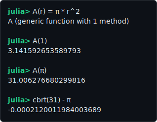
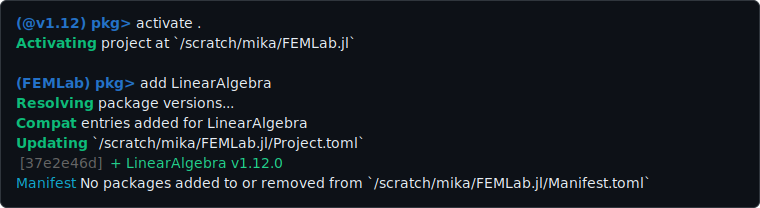
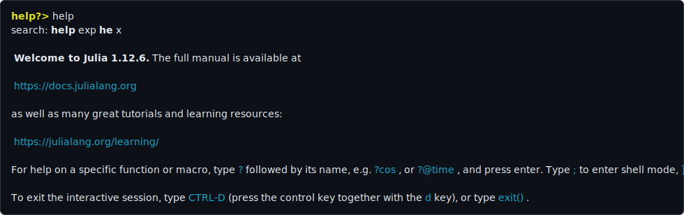
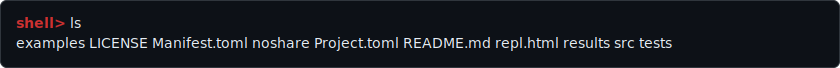
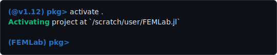

# FEMLab.jl

_`FEMLab.jl` → A starter pack for students who are new to Julia and want to use it to solve FEM assignments._

## Setup

1. Install [Julia](https://julialang.org/downloads/)
2. In Visual Studio Code install [Julia extension](https://marketplace.visualstudio.com/items?itemName=julialang.language-julia)
3. Open the directory `FEMLab.jl` in Visual Studio Code and trust the authors
4. Open Julia `REPL` (read-eval-print loop):
    - by opening the command window (`Ctrl+Shift+P`) and searching for `Julia: Start REPL`; or
    - by pressing (`Alt+J`) followed by (`Alt+O`)

> [!TIP]
> Visual Studio Code may ask about installing [`Revise.jl`](https://github.com/timholy/Revise.jl).
> `Revise.jl` allows you to modify code and use the changes without restarting Julia. This is quite useful.

## REPL

The `REPL` has five different prompt modes. The default mode (Julian, green) is where standard Julia expressions can be evaluated.
The special modes can be activated by pressing: `]`,`?`, `;`, or `Ctrl+R`. The default mode is reactivated by removing all
input or by pressing `Ctrl+C`.

### Package mode
Package mode (`]`) allows, among others, for adding packages to the current environment.

### Help mode
Help mode (`?`) can be used to print help and documentation for anything entered in help mode.

### Shell mode
Shell mode (`;`) acts like a simple system shell.

### Search mode
Search mode (`Ctrl+R`) allows for searching through the history of commands.

## First steps

Now, that Julia and VS Code are up and running, `FEMLab.jl` can be initialized. This
will download any dependencies defined in `Project.toml`.

First, check that the project environment is activated. This can be done by entering the
package mode (`]`). It should read

If instead you see

Then either enter `activate .` in the package mode, or press `Ctrl+Shift+P` and search for `Julia: Activate This Environment`.

> [!IMPORTANT]
> The `FEMLab` environment must be active if you want to use it! VS Code should
> create a `.vscode/settings.json` with a path set for `julia.environmentPath`. This
> should then be automatically activated whenever the directory is opened in VS Code.

To download all dependencies run

## Next steps

Some examples are included in the `examples` directory. Note, that `using FEMLab` must be
evaluated at least once to load the module functionality. The examples can be run
by pressing `Shift+Enter` in each line, or by selecting parts of the code and pressing
`Shift+Enter` again. You can also run whole scripts by

You can read up on the reason why `REPL.softscope` is necessary in this context
[here](https://docs.julialang.org/en/v1/manual/variables-and-scoping/).

Links to the documentation of Julia and the packages reexported by FEMLab are in `src/FEMLab.jl`.
The output files (`*.vtu`,`*.vts`,...) can be opened in [Paraview](https://www.paraview.org/).
The included packages are sufficient for the solution of all course assignments.

The repository structure can be used as a starting point for your own package. If you wish you can also just keep working inside the `FEMLab.jl` directory.